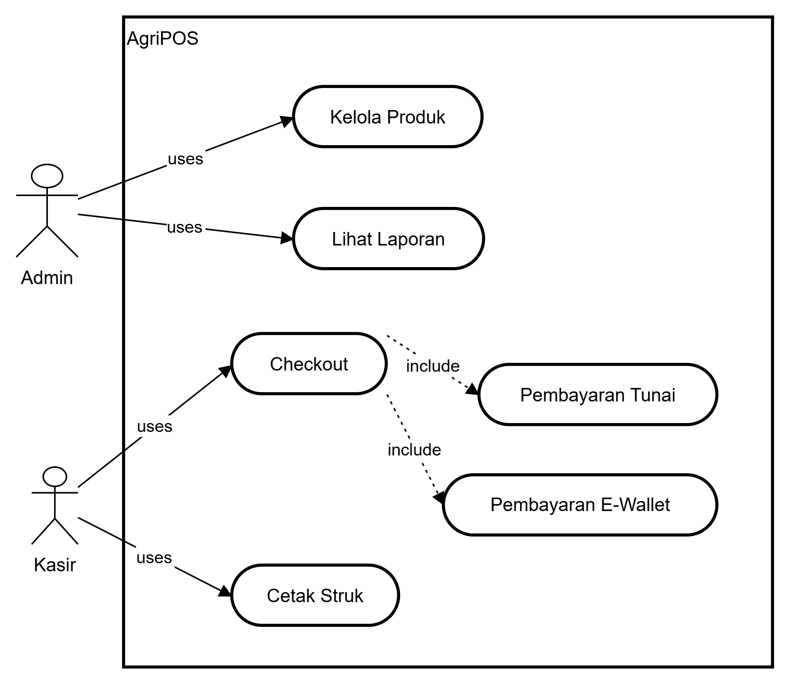
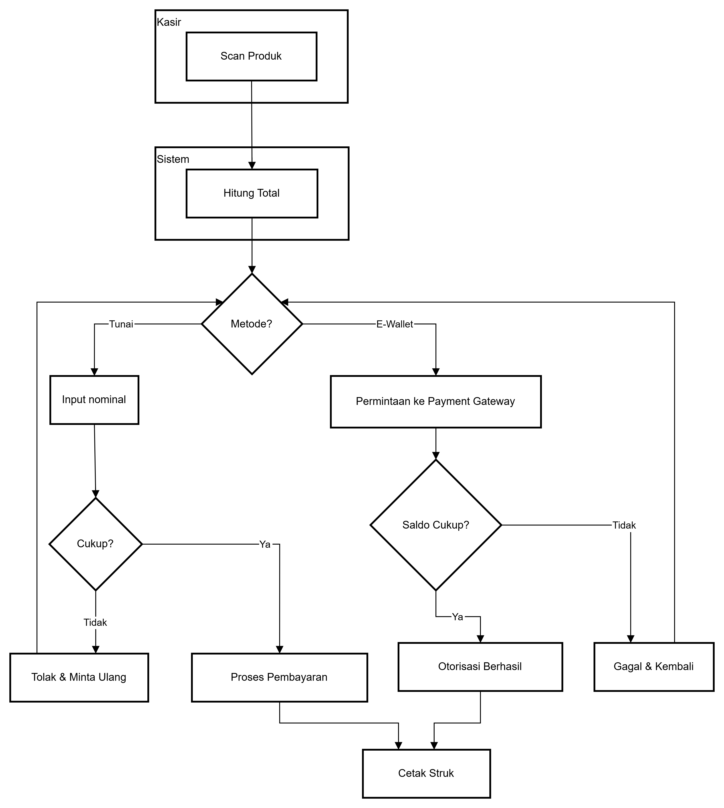
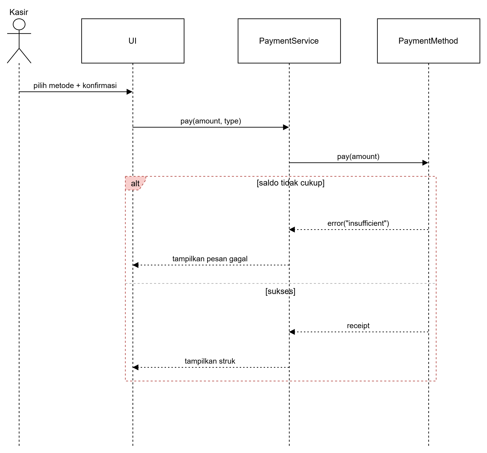
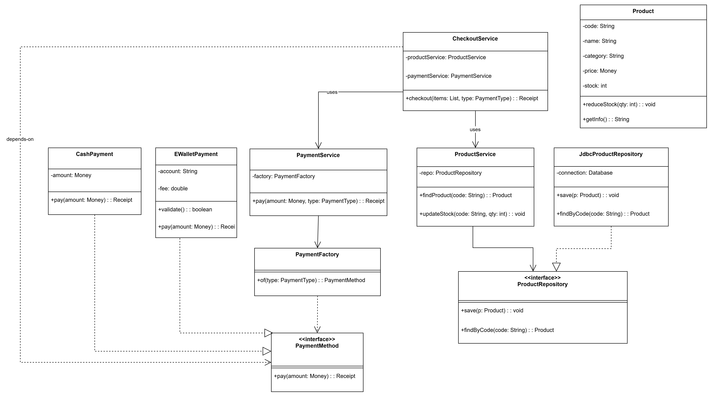

# Bab 6 – Desain Arsitektur Sistem dengan UML dan Prinsip SOLID

## Tujuan Pembelajaran

Mahasiswa mampu:

1. Mahasiswa mampu mengidentifikasi kebutuhan sistem ke dalam diagram UML.
2. Mahasiswa mampu menggambar UML Class Diagram dengan relasi antar class yang tepat.
3. Mahasiswa mampu menjelaskan prinsip desain OOP (SOLID).
4. Mahasiswa mampu menerapkan minimal dua prinsip SOLID dalam kode program.

---

## Deskripsi Tugas

Buatlah **desain arsitektur sistem *Agri-POS*** menggunakan **UML** (minimal empat diagram) dan penerapan **prinsip SOLID**, untuk memenuhi **kebutuhan sistem** yang dijelaskan di bawah ini.
Anda **diperbolehkan menggunakan tools apa pun** (Graphviz, StarUML, draw.io, PlantUML, Lucidchart, dan lain-lain), asalkan hasil akhir disimpan dan dikumpulkan dalam format **`.png` atau `.pdf`**, bisa dikumpulkan beserta file sumbernya (`.dot`, `.uml`, `.drawio`, dan sebagainya).

---

## Roadmap Pengerjaan 

Iterasi disarankan agar progres terpantau dan kualitas meningkat:

1. Pemetaan kebutuhan → daftar aktor & use case; gambar Use Case Diagram versi-1.
2. Activity Diagram proses “Checkout” (lengkap dengan swimlane Kasir/Sistem/Payment Gateway) + skenario normal dan gagal.
3. Sequence Diagram proses pembayaran (variasi: tunai vs e-wallet, alt saldo tidak cukup).
4. Class Diagram (atribut/tipe, method, visibility, multiplicity) + mapping prinsip SOLID; revisi konsistensi lintas diagram.

Setiap iterasi lakukan commit incremental dengan pesan: `week6-uml-solid: iterasi-N <deskripsi>`.

---

## Kebutuhan Sistem

### A. Functional Requirements

1. **Manajemen Produk**
   Sistem dapat menambah, mengubah, menghapus, dan menampilkan data produk pertanian (benih, pupuk, alat, obat).
   Produk memiliki atribut: `kode`, `nama`, `kategori`, `harga`, dan `stok`.

2. **Transaksi Penjualan**
   Kasir dapat membuat transaksi baru, menambahkan produk ke keranjang, menghitung total, dan menyelesaikan pembayaran.

3. **Metode Pembayaran**
   Sistem mendukung pembayaran tunai dan e-wallet. Di masa depan, metode lain seperti transfer bank harus dapat ditambahkan tanpa mengubah kode lama.

4. **Pencetakan Struk dan Laporan**
   Setelah pembayaran berhasil, sistem menampilkan atau mencetak struk.
   Admin dapat melihat laporan penjualan harian atau periodik.

5. **Login dan Hak Akses**
   Kasir dan admin memiliki hak akses berbeda (kasir untuk transaksi, admin untuk produk dan laporan).

---

### B. Non-Functional Requirements

1. **Maintainability** – Struktur kode mengikuti prinsip **Single Responsibility** dan **Dependency Inversion**.
2. **Extensibility** – Penambahan fitur baru tidak mengubah class inti (Open/Closed).
3. **Reusability** – Menggunakan **interface** dan **abstraksi** agar mudah diuji.
4. **Consistency** – Penamaan dan dokumentasi konsisten antar komponen.
5. **Documentability** – Semua desain didokumentasikan dalam empat diagram UML.

---

#### Opsional: Next-Level Requirements

Tambahan Functional Requirements (opsional):
- Pengembalian barang/retur dan refund pembayaran.
- Diskon, promosi, kupon/voucher dengan aturan fleksibel (rules engine/strategy).
- Manajemen pelanggan dan loyalty (poin, tier, histori belanja).
- Inventori lanjutan: reorder level, pemasok, stok opname, batch/expiry (terkait produk pertanian).
- Multi-toko/warehouse; transfer stok antar gudang.
- Pembayaran lanjutan: QRIS/payment gateway, split payment, partial payment, refund flow.
- Mode offline (kasir tetap transaksi saat jaringan putus) + mekanisme sinkronisasi.
- Audit log dan approval workflow (mis. retur/void butuh persetujuan supervisor).
- Pajak multi-tarif, multi-mata uang, dan template struk dapat dikonfigurasi.

Tambahan Non-Functional Requirements (opsional):
- Performa: waktu checkout < 2 detik untuk 100 item; p95 latency terukur.
- Keandalan/Ketersediaan: target SLA 99.5%; graceful degradation saat offline.
- Keamanan: patuhi OWASP Top 10/ASVS; enkripsi data in-transit/at-rest; least privilege; proteksi PII.
- Skalabilitas: mendukung ≥50 sesi kasir bersamaan; siap scale-out.
- Observabilitas: structured logging, metrik (QPS, error rate, p95), tracing untuk alur pembayaran.
- Testability: dependency injection, repository dapat di-mock; target coverage inti ≥60% (guideline).
- Portabilitas: abstraksi storage (repository) agar DB-agnostik (Postgres/MySQL).
- Aksesibilitas & i18n/l10n: dukung tema kontras/keyboard nav; multi bahasa jika diperlukan.
- Kepatuhan: pemenuhan regulasi pajak/arsip struk sesuai kebijakan setempat.

Cara mengadopsi opsi next-level (opsional):
1. Tambahkan item pada daftar FR/NFR di laporan dan beri label “OPSIONAL”.
2. Perluas Use Case Diagram (mis. UC-Refund, UC-Manage Promotions).
3. Tambah skenario pada Activity/Sequence (alt untuk refund gagal, sinkronisasi offline, dsb.).
4. Perbarui Class Diagram dengan pola yang relevan (Strategy untuk diskon, State untuk order lifecycle, Observer untuk stok).
5. Update tabel Traceability agar FR opsional terhubung ke diagram dan kelas/antarmuka yang merealisasikannya.
6. Cantumkan asumsi dan batasan agar ruang lingkup tetap terkontrol.

Catatan: Fitur opsional tidak wajib untuk kelulusan baseline, tetapi memberikan nilai tambah (bonus) pada rubrik jika konsisten, dapat ditelusuri, dan didesain dengan baik.

---

## Ketentuan Desain

Mahasiswa **wajib membuat minimal empat diagram berikut**:

| Jenis Diagram        | Tujuan                                                                                          | Format File                 |
| -------------------- | ----------------------------------------------------------------------------------------------- | --------------------------- |
| **Use Case Diagram** | Menjelaskan aktor dan fungsionalitas sistem                                                     | `.dot` / `.drawio` / `.png` |
| **Activity Diagram** | Menggambarkan alur proses utama (contoh: Checkout)                                              | `.dot` / `.drawio` / `.png` |
| **Sequence Diagram** | Menunjukkan interaksi antar objek (contoh: proses pembayaran)                                   | `.dot` / `.drawio` / `.png` |
| **Class Diagram**    | Menjelaskan struktur class, atribut, method, dan relasi (association, inheritance, composition) | `.dot` / `.drawio` / `.png` |

Selain itu, setiap mahasiswa harus menjelaskan **penerapan prinsip SOLID** yang muncul dalam desain, mencakup:

* **S** – Single Responsibility Principle
* **O** – Open/Closed Principle
* **L** – Liskov Substitution Principle
* **I** – Interface Segregation Principle
* **D** – Dependency Inversion Principle

### Acceptance Criteria per Diagram

- Use Case: semua aktor dan use case dari FR tercakup; relasi include/extend bila relevan; deskripsi singkat tiap use case.
- Activity: swimlane, decision/merge, fork/join jika ada, node start/finish; sertakan alternatif kegagalan (stok habis/saldo kurang).
- Sequence: lifeline jelas, message sinkron/async sesuai, guard `[alt]/[opt]`, return value; minimal 1 skenario sukses dan 1 gagal.
- Class: nama paket, atribut (tipe + visibility), method (signature + visibility), relasi (association/aggregation/composition/inheritance) lengkap multiplicity.

---

## Output yang Dikumpulkan

Struktur folder pengumpulan:

```
praktikum/week6-uml-solid/
 ├─ docs/
 │   ├─ uml_usecase.png
 │   ├─ uml_activity.png
 │   ├─ uml_sequence.png
 │   └─ uml_class.png
 ├─ src/uml/                  # (opsional tapi disarankan) sumber diagram
 │   ├─ usecase.mmd|drawio|dot
 │   ├─ activity.mmd|drawio|dot
 │   ├─ sequence.mmd|drawio|dot
 │   └─ class.mmd|drawio|dot
 └─ laporan_week6.md
```

**Laporan (`laporan_week6.md`)** harus berisi:

1. Deskripsi singkat sistem.
2. Penjelasan setiap diagram (fungsi dan keterkaitan antar diagram).
3. Penjelasan penerapan prinsip SOLID.
4. Kesimpulan dan refleksi singkat (keunggulan serta potensi pengembangan sistem).

Tambahkan tabel **Traceability** yang memetakan FR → Diagram → Kelas/Interface realisasi.

Contoh:

| FR | Use Case | Activity/Sequence | Class/Interface |
|----|----------|-------------------|-----------------|
| Manajemen Produk | UC-Kelola Produk | Activity Produk | ProductService, ProductRepository |
| Pembayaran | UC-Checkout | Seq Pembayaran (Cash/EWallet) | PaymentMethod, CashPayment, EWalletPayment, PaymentService |

**Commit message:**

```
week6-uml-solid: iterasi-N <deskripsi>
```

---

## Rubrik Penilaian

| Aspek                                      | Bobot | Kriteria                                               |
| :----------------------------------------- | ----: | :----------------------------------------------------- |
| Kelengkapan dan Kualitas Empat Diagram UML |   40% | Struktur benar, saling konsisten, mudah dibaca         |
| Penerapan Prinsip SOLID                    |   40% | Minimal tiga prinsip diterapkan dengan jelas           |
| Laporan dan Argumentasi Desain             |   15% | Rasional desain, keterkaitan UML dengan prinsip SOLID  |
| Kepatuhan Format dan Dokumentasi           |    5% | Struktur repository, penamaan file, dan commit message |

Catatan rubric:
- Konsistensi lintas diagram (aktor/use case/kelas/urutan pesan) dinilai.
- Multiplicity dan visibility pada Class Diagram wajib.
- Sequence wajib memuat alternatif (alt/opt) untuk error handling.
- SOLID dinilai dari argumentasi dan keterlihatan pada desain (bukan sekadar teori).

---

## Catatan Tambahan

1. Mahasiswa **tidak perlu membuat implementasi aplikasi lengkap**, cukup rancangan arsitektur dan hubungan antar komponen.
2. Gunakan nama class, method, dan relasi yang relevan dengan domain pertanian digital.
3. Mahasiswa **diperbolehkan menggunakan tool UML apa pun**, yang penting hasil akhir sesuai standar UML.
4. Desain harus menunjukkan **pola pikir rekayasa perangkat lunak yang sistematis**: modular, reusable, extensible, dan terdokumentasi dengan baik.

### Konvensi & Penamaan
- Paket: `com.upb.agripos.<modul>` (contoh: `com.upb.agripos.payment`).
- File gambar: `uml_usecase.png`, `uml_activity.png`, `uml_sequence.png`, `uml_class.png`.
- Simpan juga file sumber (.mmd/.drawio/.dot) di `src/uml/` dengan penamaan konsisten.
- Resolusi gambar min 1600px agar terbaca jelas di laporan.

---

## Quiz (Sesuai RPS)

1. Jelaskan perbedaan **aggregation** dan **composition** serta berikan contoh penerapannya pada desain Anda.
2. Bagaimana prinsip **Open/Closed** dapat memastikan sistem mudah dikembangkan?
3. Mengapa **Dependency Inversion Principle (DIP)** meningkatkan **testability**? Berikan contoh penerapannya.

---

## Contoh Penerapan SOLID (Guidance)

- Strategy + Factory untuk pembayaran (OCP, DIP):
   - Interface `PaymentMethod { pay(amount) }`
   - Implementasi: `CashPayment`, `EWalletPayment`
   - `PaymentFactory` atau registry memilih implementasi berdasarkan tipe
   - `PaymentService` bergantung pada `PaymentMethod` (interface), bukan implementasi

- Repository Pattern (DIP):
   - Interface `ProductRepository { save(), findByCode() }`
   - Implementasi `JdbcProductRepository`, mudah diganti `JpaProductRepository`
   - `ProductService` menerima `ProductRepository` via constructor injection

Tambahkan ini pada Class/Sequence Diagram agar keterhubungan SOLID terlihat, bukan sekadar deskripsi teks.

---

## Contoh Diagram

Use Case:



Activity Checkout:



Sequence Pembayaran:



Class Diagram:



---

## Checklist Pemeriksaan Mandiri

- [ ] Semua FR tercover di Use Case Diagram
- [ ] Activity & Sequence memuat alur sukses dan gagal (alt/opt)
- [ ] Class Diagram memiliki visibility, tipe, multiplicity, dan paket
- [ ] Mapping SOLID (min 3) ditunjukkan di desain dan dijelaskan di laporan
- [ ] Konsistensi penamaan antar diagram terjaga
- [ ] File sumber diagram disertakan (`src/uml/`) + gambar `docs/`
- [ ] Commit mengikuti format `week6-uml-solid: iterasi-N <deskripsi>`

## Referensi

* Freeman, E. (2020). *Head First Design Patterns* (Bab 1–3).
* Gamma, E. et al. (2018). *Design Patterns: Elements of Reusable Object-Oriented Software*.
* Robert C. Martin. *SOLID Principles*.
* Object Management Group (OMG). *UML Specification*.
